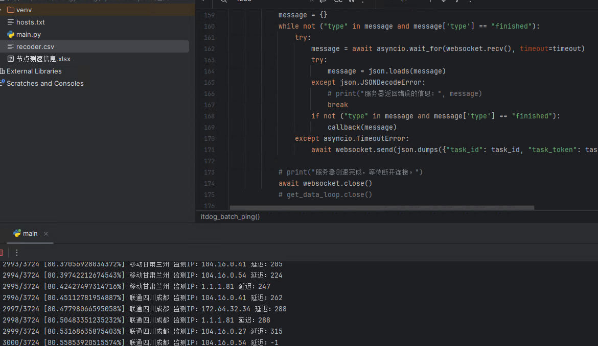
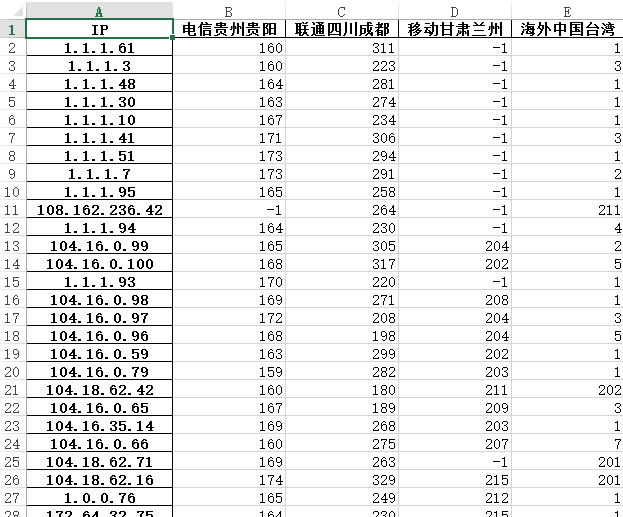
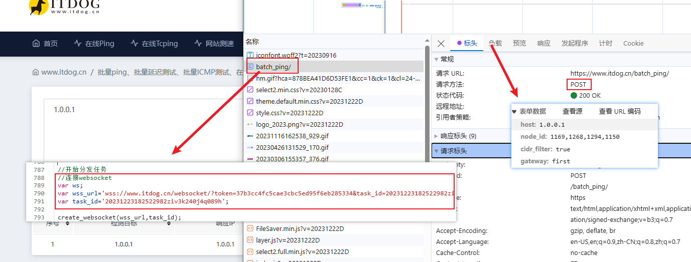
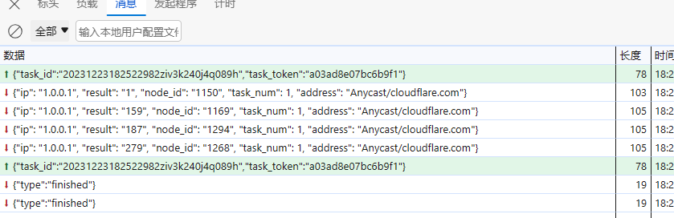
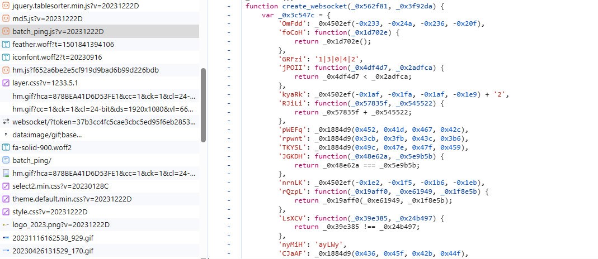
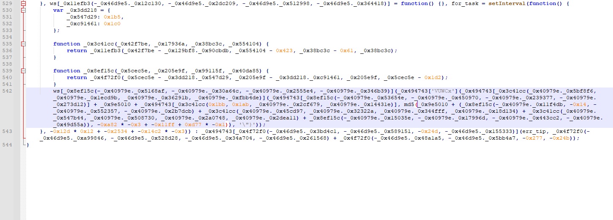
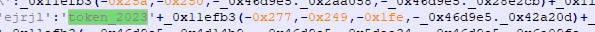
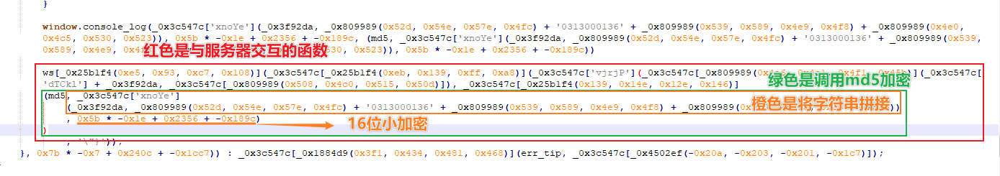
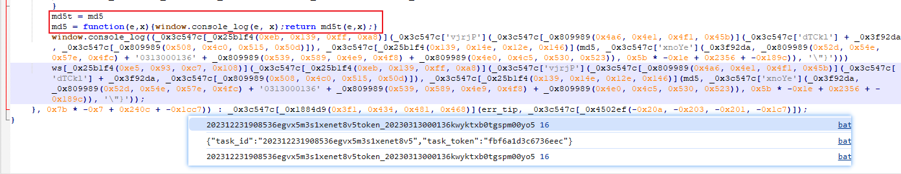

# itdog 测速网站批量 Ping 节点爬虫脚本

### 绪言
[itdog.cn](https://www.itdog.cn/) 是一个专注于网络测试与分析的在线工具网站，适合IT专业人员和网络管理员使用。该网站提供了一系列工具，如在线Ping和Tcping测试，支持IPv4和IPv6，帮助用户从不同地区和路线检测网络连接情况。此项目是在我在忙碌的学业之路上写的一个批量爬取 itdog 网站 Ping 数据的爬虫。也许这个是我高中写的最后一个项目了吧？

我原来打算的是使用这个测速网站来自选 Cloudflare 节点的，不知道还有没有时间将这个项目和 ddgth 大佬的项目 [cf2dns](https://github.com/ddgth/cf2dns) 联动起来。因为 ddgth 大佬的项目中的获取优质 Cloudflare 节点的算法是未开源的，而是通过请求网络 API 的方式从别的服务器获取 Cloudflare 节点。如果我学有余力，我会尝试去联动一下。ψ(*｀ー´)ψ

### 更新

2024.11.16 由于 itdog 设置 Cookie 效验反爬，程序进行修改，并增加网站测速爬虫。

### 分析数据

我自己编写了一些爬虫，生成了一下 Cloudflare 的节点测速结果，放在目录 `Cloudflare_Data` 下，需要的同学或老师可以自行下载。





### 代码示例

你可以将 `itdog_ping.py` 作为模块导入，也可以直接修改该文件，总之要确保您可以调用到自定义函数 `itdog_batch_ping` 。

函数体如下：

```python
def itdog_batch_ping(host, node_id, callback, cidr_filter=True, gateway="last", timeout=10):
    """
    爬取 itdog 测速网站，批量 Ping 服务器。

    :param host: 检测的IP地址，参考：域名或IPv4，每行一个，IP可填入范围和CIDR形式，可混合，最多支持256个检测目标 / 1万个字符。（传入列表，每一个项代表一行）
    :param node_id: 节点ID，使用“,”分隔。参考：1274,1226,1282,1150
    :param callback: 检测结果回调函数，回调函数应该提供一个参数，用于接收字典。参考字典：
                    {'ip': '检测的IP地址', 'result': '延迟', 'node_id': '节点ID', 'task_num': 99（任务数）, 'address': '解析到的服务器地理位置'}
    :param cidr_filter:  是否过滤CIDR格式中的网络地址、网关地址、广播地址，True 或 False，默认为 True
    :param gateway:  最后一个是网关地址（last，默认） 还是 第一个是网关地址（first）
    :param timeout:  最大等待服务器返回数据超时。
    """
```

简单调用：

```python
itdog_batch_ping("1.0.0.1", "1274", lambda info: print(info))
```

你会获得输出：

```python
{'ip': '1.0.0.1', 'result': '171', 'node_id': '1274', 'task_num': 1, 'address': 'Anycast/cloudflare.com'}
```

***节点ID请参阅 [view-source:https://www.itdog.cn/batch_ping/](view-source:https://www.itdog.cn/batch_ping/) 的源代码，文章末尾也会给出节点信息，不保证实时更新。***

### 爬虫分析



当用户请求 IP 测速的时候，网页会提交 POST 表单到当前网页 `https://www.itdog.cn/batch_ping/` 。随后，网页会请求 websocket 链接到服务器进行测速。

通过抓包，我们可以找出网页（客户端）与服务器的交互：



请求中的 `task_id` 我们是已知的，关键是要找出 `task_token` 的生成方式。略去过程， `task_token` 生成规则如下：

将提供的 `task_id` 加上一段不变的文本 `token_20230313000136kwyktxb0tgspm00yo5`，最后结果取 md5 16位小就是 `task_token` 了。下面是分析的过程：

网页创建 websocket 时会调用自定义函数 `create_websocket`，找出函数出自 js 文件 `https://www.itdog.cn/frame/js/pages/batch_ping.js`，通过浏览器的自动整理后如下：



`create_websocket` 函数被混淆了，不过我们还是可以看出一些端倪：



上述是与服务器通讯的主要地方，通过 Fiddler 抓包篡改代码，加入一段 `console.log` 看看到底通讯的什么，以便于我们定位函数。已知的坑如下：

+ 尝试将全部代码格式化并篡改，网页无法正常加载，已知卡在加载的时候，阻塞浏览器。*可以通过仅格式化函数 `create_websocket` 解决。*
+ 尝试使用 `console.log` 输出内容，结果发现 `console.log` 被重写了。*可以通过在代码最开头加上 window.console_log = console.log 提前保留输出函数。*

最后，是分析到请求时会将 `task_id` 加上一个固定字符串 `token_20230313000136kwyktxb0tgspm00yo5` 并取 `md5` 获取 `task_token`。

当然，这个 `task_token` 生成方法并非一直有效，依赖于固定字符串 `token_20230313000136kwyktxb0tgspm00yo5` 是否变化，因为这个字符串清晰标明了“token_2023”估计会在2024年重新设置。代码中定位 `token_2023` 你会找到：



这个至少当前是固定不变的。想研究的同学 `batch_ping.js` 样本已经放置在仓库的 `JavaScript_sample` 目录下。

***重要：batch_ping.js 在 2023/12/23 似乎重新混淆了代码，但是并不影响先前的爬虫算法。文章的配图是 2023/12/23 版本的代码。***

新解密提供两种思路：



直接分析。



重写 md5 函数。

## 节点ID参考

| Node ID | 运营商 | 地点           | Node ID | 运营商 | 地点           |
| ------- | ------ | -------------- | ------- | ------ | -------------- |
| 1168    | 电信   | 辽宁大连       | 1252    | 联通   | 陕西西安       |
| 1134    | 电信   | 江西南昌       | 1259    | 联通   | 西藏拉萨       |
| 1124    | 电信   | 新疆乌鲁木齐   | 1301    | 联通   | 辽宁大连       |
| 1129    | 电信   | 吉林长春       | 1296    | 联通   | 安徽芜湖       |
| 1312    | 电信   | 江苏镇江       | 1276    | 联通   | 湖北武汉       |
| 1127    | 电信   | 甘肃兰州       | 1303    | 联通   | 山东济南       |
| 1131    | 电信   | 山西太原       | 1254    | 联通   | 上海           |
| 1228    | 电信   | 陕西西安       | 1298    | 联通   | 河北邯郸       |
| 1136    | 电信   | 广西南宁       | 1267    | 联通   | 黑龙江佳木斯   |
| 1311    | 电信   | 湖南长沙       | 1264    | 联通   | 海南海口       |
| 1138    | 电信   | 重庆           | 1300    | 联通   | 河南郑州       |
| 1151    | 电信   | 福建泉州       | 1299    | 联通   | 贵州贵阳       |
| 1307    | 电信   | 河北石家庄   | 1260    | 联通   | 新疆乌鲁木齐   |
| 1123    | 电信   | 青海西宁       | 1253    | 联通   | 重庆           |
| 1310    | 电信   | 北京           | 1302    | 联通   | 福建泉州       |
| 1128    | 电信   | 黑龙江哈尔滨   | 1255    | 联通   | 青海西宁       |
| 1319    | 电信   | 宁夏银川       | 1262    | 联通   | 山西太原       |
| 1214    | 电信   | 湖北武汉       | 1265    | 联通   | 江西南昌       |
| 1132    | 电信   | 天津           | 1263    | 联通   | 宁夏银川       |
| 1320    | 电信   | 安徽滁州       | 1258    | 联通   | 广西柳州       |
| 1169    | 电信   | 广东深圳       | 1257    | 联通   | 云南昆明       |
| 1170    | 电信   | 内蒙古         | 1275    | 联通   | 江苏泰州       |
| 1308    | 电信   | 山东青岛       | 1277    | 联通   | 湖南湘潭       |
| 1227    | 电信   | 上海           | 1273    | 联通   | 北京           |
| 1313    | 电信   | 福建龙岩       | 1266    | 联通   | 天津           |
| 1137    | 电信   | 云南昆明       | 1278    | 联通   | 广东潮州       |
| 1306    | 电信   | 河南洛阳       | 1219    | 海外   | 美国洛杉矶     |
| 1135    | 电信   | 海南海口       | 1192    | 海外   | 马来西亚       |
| 1305    | 电信   | 浙江宁波       | 1150    | 海外   | 中国台湾       |
| 1218    | 电信   | 西藏拉萨       | 1148    | 海外   | 美国洛杉矶     |
| 1274    | 电信   | 贵州贵阳       | 1156    | 海外   | 菲律宾         
| 1304    | 电信   | 四川成都       | 1316    | 海外   | 新加坡         |
| 1252    | 联通   | 陕西西安       | 1317    | 海外   | 美国弗吉尼亚   |
| 1259    | 联通   | 西藏拉萨       | 1158    | 海外   | 美国洛杉矶     |
| 1301    | 联通   | 辽宁大连       | 1322    | 海外   | 美国西雅图     |
| 1296    | 联通   | 安徽芜湖       | 1315    | 海外   | 中国香港       |
| 1276    | 联通   | 湖北武汉       | 1213    | 海外   | 日本东京       |
| 1303    | 联通   | 山东济南       | 1279    | 移动   | 新疆克拉玛依   | 
| 1254    | 联通   | 上海          | 1237    | 移动   | 江苏南京       | 
| 1298    | 联通   | 河北邯郸       | 1243    | 移动   | 山东济南       | 
| 1267    | 联通   | 黑龙江佳木斯   | 1288    | 移动   | 福建厦门       | 
| 1264    | 联通   | 海南海口       | 1249    | 移动   | 上海           |
| 1300    | 联通   | 河南郑州       | 1233    | 移动   | 浙江杭州       | 
| 1299    | 联通   | 贵州贵阳       | 1246    | 移动   | 河南郑州       | 
| 1260    | 联通   | 新疆乌鲁木齐   | 1294    | 移动   | 海南海口       | 
| 1253    | 联通   | 重庆          | 1295    | 移动   | 天津           |
| 1302    | 联通   | 福建泉州       | 1293    | 移动   | 辽宁大连       | 
| 1255    | 联通   | 青海西宁       | 1286    | 移动   | 河北承德       | 
| 1262    | 联通   | 山西太原       | 1287    | 移动   | 湖北武汉       |
| 1265    | 联通   | 江西南昌       | 1283    | 移动   | 四川成都       |
| 1263    | 联通   | 宁夏银川       | 1245    | 移动   | 重庆           |
| 1258    | 联通   | 广西柳州       | 1291    | 移动   | 黑龙江哈尔滨   |
| 1257    | 联通   | 云南昆明       | 1273    | 联通   | 北京           |
| 1275    | 联通   | 江苏泰州       | 1266    | 联通   | 天津           |
| 1277    | 联通   | 湖南湘潭       | 1278    | 联通   | 广东潮州       |

Python列表：

```python
node_ids = {
    "1168": ["电信", "辽宁大连"],
    "1134": ["电信", "江西南昌"],
    "1124": ["电信", "新疆乌鲁木齐"],
    "1129": ["电信", "吉林长春"],
    "1312": ["电信", "江苏镇江"],
    "1127": ["电信", "甘肃兰州"],
    "1131": ["电信", "山西太原"],
    "1228": ["电信", "陕西西安"],
    "1136": ["电信", "广西南宁"],
    "1311": ["电信", "湖南长沙"],
    "1138": ["电信", "重庆"],
    "1151": ["电信", "福建泉州"],
    "1307": ["电信", "河北石家庄"],
    "1123": ["电信", "青海西宁"],
    "1310": ["电信", "北京"],
    "1128": ["电信", "黑龙江哈尔滨"],
    "1319": ["电信", "宁夏银川"],
    "1214": ["电信", "湖北武汉"],
    "1132": ["电信", "天津"],
    "1320": ["电信", "安徽滁州"],
    "1169": ["电信", "广东深圳"],
    "1170": ["电信", "内蒙古"],
    "1308": ["电信", "山东青岛"],
    "1227": ["电信", "上海"],
    "1313": ["电信", "福建龙岩"],
    "1137": ["电信", "云南昆明"],
    "1306": ["电信", "河南洛阳"],
    "1135": ["电信", "海南海口"],
    "1305": ["电信", "浙江宁波"],
    "1218": ["电信", "西藏拉萨"],
    "1274": ["电信", "贵州贵阳"],
    "1304": ["电信", "四川成都"],
    "1252": ["联通", "陕西西安"],
    "1259": ["联通", "西藏拉萨"],
    "1301": ["联通", "辽宁大连"],
    "1296": ["联通", "安徽芜湖"],
    "1276": ["联通", "湖北武汉"],
    "1303": ["联通", "山东济南"],
    "1254": ["联通", "上海"],
    "1298": ["联通", "河北邯郸"],
    "1267": ["联通", "黑龙江佳木斯"],
    "1264": ["联通", "海南海口"],
    "1300": ["联通", "河南郑州"],
    "1299": ["联通", "贵州贵阳"],
    "1260": ["联通", "新疆乌鲁木齐"],
    "1253": ["联通", "重庆"],
    "1302": ["联通", "福建泉州"],
    "1255": ["联通", "青海西宁"],
    "1262": ["联通", "山西太原"],
    "1265": ["联通", "江西南昌"],
    "1263": ["联通", "宁夏银川"],
    "1258": ["联通", "广西柳州"],
    "1257": ["联通", "云南昆明"],
    "1275": ["联通", "江苏泰州"],
    "1277": ["联通", "湖南湘潭"],
    "1273": ["联通", "北京"],
    "1266": ["联通", "天津"],
    "1278": ["联通", "广东潮州"],
    "1256": ["联通", "甘肃兰州"],
    "1268": ["联通", "吉林长春"],
    "1297": ["联通", "浙江杭州"],
    "1226": ["联通", "四川成都"],
    "1261": ["联通", "内蒙古"],
    "1279": ["移动", "新疆克拉玛依"],
    "1237": ["移动", "江苏南京"],
    "1243": ["移动", "山东济南"],
    "1288": ["移动", "福建厦门"],
    "1249": ["移动", "上海"],
    "1233": ["移动", "浙江杭州"],
    "1246": ["移动", "河南郑州"],
    "1294": ["移动", "海南海口"],
    "1295": ["移动", "天津"],
    "1293": ["移动", "辽宁大连"],
    "1286": ["移动", "河北承德"],
    "1287": ["移动", "湖北武汉"],
    "1283": ["移动", "四川成都"],
    "1245": ["移动", "重庆"],
    "1291": ["移动", "黑龙江哈尔滨"],
    "1250": ["移动", "北京"],
    "1280": ["移动", "内蒙古"],
    "1285": ["移动", "山西太原"],
    "1248": ["移动", "陕西西安"],
    "1292": ["移动", "吉林长春"],
    "1289": ["移动", "广西南宁"],
    "1242": ["移动", "湖南长沙"],
    "1290": ["移动", "广东深圳"],
    "1281": ["移动", "青海西宁"],
    "1318": ["移动", "安徽淮南"],
    "1244": ["移动", "贵州贵阳"],
    "1284": ["移动", "宁夏银川"],
    "1247": ["移动", "云南昆明"],
    "1321": ["移动", "西藏拉萨"],
    "1282": ["移动", "甘肃兰州"],
    "1219": ["海外", "美国洛杉矶"],
    "1192": ["海外", "马来西亚"],
    "1150": ["海外", "中国台湾"],
    "1148": ["海外", "美国洛杉矶"],
    "1156": ["海外", "菲律宾"],
    "1316": ["海外", "新加坡"],
    "1317": ["海外", "美国弗吉尼亚"],
    "1158": ["海外", "美国洛杉矶"],
    "1322": ["海外", "美国西雅图"],
    "1315": ["海外", "中国香港"],
    "1213": ["海外", "日本东京"]
}
```